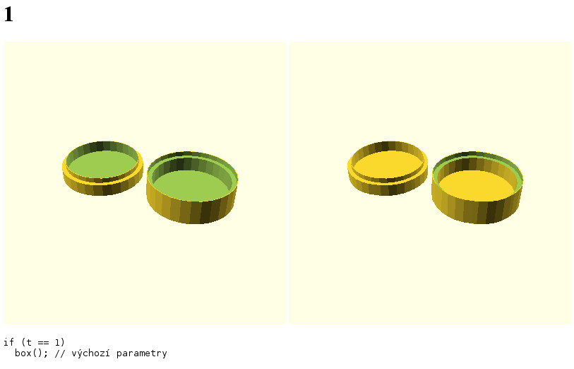

cards-stand-task
================

Tests for BI-3DT homework.

Information for students
------------------------

To run the tests on your code, put your `cardholder.scad` in `students/username/cardholder.scad` and proceed with **Running the tests** section.

Adding test cases
-----------------

To add a test case, open `tests.scad` and add a new test to the end of the file, before the comments section:

    if (t == X) {
      // your test here
    }

Where `X` is the number of the test and must be `last_number_used+1`, otherwise the test suite breaks.

To be able to see your code, you can do one of the following:

 * Code your test without the `if` statement and surround it by `if` after you are satisfied.
 * Add `t = X;` somewhere outside of `if` statement (i.e. to the global scope), don't forget to remove it before commiting.

**Never manipulate the 3D view by mouse** (zoom, shift, rotate), only manipulate the view by OpenSCAD code:

    if (t == X) {
      translate(...)
        rotate(...)
          box(...);
    }

If you happen to manipulate the view by accident, you can select **Reset view** from the **View** menu.

For your convenience, few modules are provided:

The `distance()` module lets you see the object from a greater distance, because the default arguments won't fit into the canvas. It takes a `factor` argument (default 1) if you need to make the distance longer. This is how it works:

    if (t == X)
      distance(1.2)
        cardholder(...);

The `cut()` module lets you see the slice of an object. See how it works:

    if (t == Y)
      cut()
        cardholder(..., $fn=100);

The cut is done by YZ plane, and is translated to the view. Also notice that you can and shall use `$fn` when necessary - for example to avoid different results depending on the initial position of a corner circle/cylinder. Cut also takes a `factor` argument to move it closer or more far away. It also takes a bool `horizontal` argument, but that's experimental.

When adding new test, check if *our* `cardholder.scad` works as expected!

Downloading from Edux
---------------------

You'll need two files: `usernames.txt` and `cookie.txt`. The first lists usernames of our students (see `usernames.txt.sample` for syntax). The second one adds exactly one cookie from Edux (it's the longest one) - see `cookie.txt.sample` for syntax.

Note: Be sure to log in to Edux using anything but Shibboleth before you copy the cookie. Also thick the *remember me* checkbox.

For security reasons, those files are not stored in git and are gitignored.

When ready, run `./download.sh` to download stuff from Edux.

Running the tests
-----------------

Once downloaded the solutions from Edux or once put your solution to the right folder, run `./runtests.sh` to run the tests. For each student, the jobs run in parallel. Your CPUs might get a bit hot.

Examining the results
---------------------

To see the result, use your web browser to view `index.html` (located in each student's folder).

I do this:

    favorite-webbrowser students/*/index.html

Tested thing is on the right (screen form the box task):

**Notes:** Some images are missing from the HTML report, that's because no geometry was present. Sometimes empty image is shown. Consider no image and empty image the same. Also note the colors do not take any significant role in the results.

This test suite only works with OpenSCAD 2015.03. It doesn't work on older versions.
